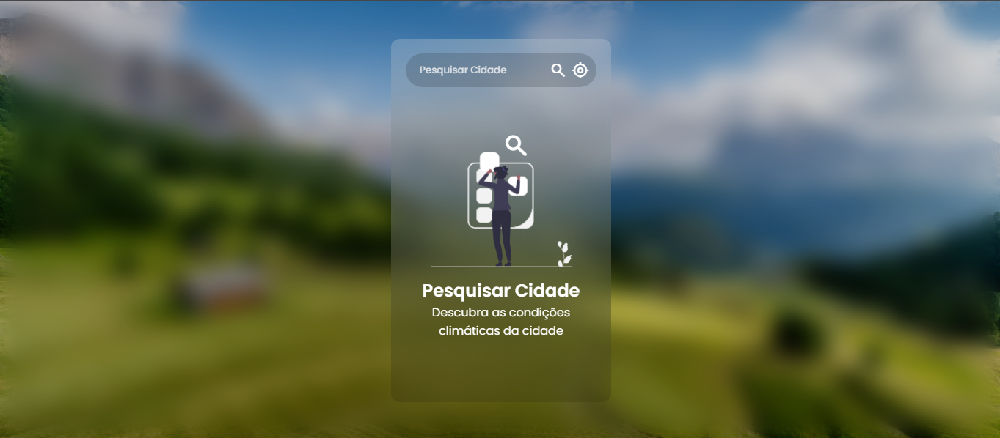
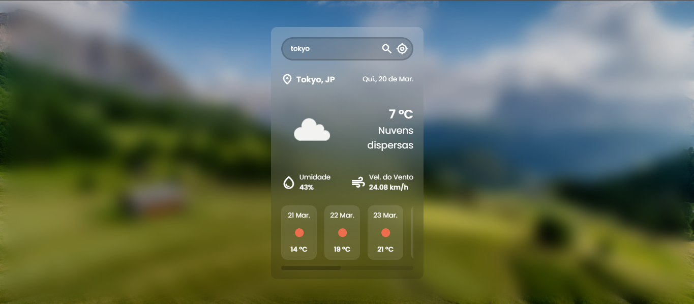

# 🌤️ Projeto de Clima

Este é um aplicativo de previsão do tempo desenvolvido em **React** e **TypeScript**, utilizando a API do **OpenWeather** para obter informações meteorológicas em tempo real.

## 🚀 Tecnologias Utilizadas

- [React](https://react.dev/)
- [TypeScript](https://www.typescriptlang.org/)
- [OpenWeather API](https://openweathermap.org/api) para dados climáticos

## 📦 Instalação

1. Clone este repositório:

   ```sh
   git clone https://github.com/pvss-dev/weather-app.git
   ```

2. Instale as dependências:

   ```sh
   npm install
   ```

3. Crie um arquivo `.env` na raiz do projeto e adicione sua chave da API do OpenWeather:

   ```env
   VITE_OPEN_WEATHER_KEY=SUA_CHAVE_AQUI
   ```

## ▶️ Como Rodar o Projeto

Após instalar as dependências, execute o projeto com o seguinte comando:

```sh
npm run dev
```

A aplicação estará disponível em `http://localhost:5173/`.

## 📌 Funcionalidades

- Busca a previsão do tempo por cidade
- Exibe temperatura, umidade, previsões etc.
- Ícones representando as condições climáticas
- Atualização em tempo real ao pesquisar novas cidades

## 📸 Captura de Tela

### 🔍 Tela de Pesquisa


### 🌤️ Tela de Previsão do Tempo

